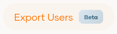
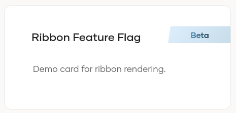

# Using Feature Flags

Feature flags enable conditionally enabling and labelling features in Identity Server console dynamically, allowing developers to 
deploy new features safely, perform A/B testing, and roll out features incrementally. In this guide, we'll walk through how to 
define and use feature flags in identity-apps React applications.


- [Conditionally Enabling/Disabling Features](#conditionally-enablingdisabling-features)
- [Denoting Feature Status Using Feature Labels](#changing-ui-behaviour-using-feature-labels)
- [Using Nested Features (sub features)](#using-nested-features-sub-features)

## Conditionally Enabling/Disabling Features

You can use feature flags to conditionally disable or enable features and control whether certain UI elements are shown in the application.


1. Identify the High-Level Feature

First, determine which feature you want to control using a feature flag. For example, let's say we want to control the visibility
of a new "filter by metadata attribute" input field in organizations page. In this case, the high level feature is "organizations".

2. Locate Feature Config in Deployment Config

The deployment configuration in each React app includes a section for feature flags. Go to the file and locate the relevant
feature config object for your feature.

deployment.config.json:

```js
{
  "ui": {
    "features": {
      // other features,
      "organizations": { 
        "disabledFeatures": [],
        "enabled": true,
        "scopes": {
          "create": [ 
            "internal_organization_create"
          ],
          "delete": [ "internal_organization_delete" ],
          "feature": [ "console:organizations" ],
          "read": [ "internal_organization_view" ], 
          "update": [ "internal_organization_update" ] 
        }
      },   
    }
  }
}
```

3. Choose a Suitable Feature Identifier

Select a unique and descriptive identifier for your feature. For our example, we'll use `organizations.filterByMetadataAttributes`.

4. Update the Disabled Features Array
   
Add your feature identifier to the `disabledFeatures` array in your configuration.

Updated deployment.config.json:

```js
{
  "ui": {
    "features": {
      // other features,
      "organizations": { 
        "disabledFeatures": [
          "organizations.filterByMetadataAttributes"
        ],
        "enabled": true,
        "featureFlags": [],
        "scopes": {
          "create": [ 
            "internal_organization_create"
          ],
          "delete": [ "internal_organization_delete" ],
          "feature": [ "console:organizations" ],
          "read": [ "internal_organization_view" ], 
          "update": [ "internal_organization_update" ] 
        }
      },   
    }
  }
}
```

5. Use Feature Flags in Your Code

Finally, use the feature flag to conditionally show/hide UI elements or run specific logic in your React components.

Example:

```js
import { isFeatureEnabled } from "@wso2is/core/helpers"

const App = () => {
  const organizationFeatureConfig: string[] = useSelector((state: AppState) =>
        state.config.ui.features?.organizations);

  return (
    <div>
      <h1>Organizations</h1>
      {isFeatureEnabled(organizationFeatureConfig, "organizations.filterByMetadataAttributes") && (
        <Select>
          <label>Select metadata attribute</label>
        </Select>
      )}
    </div>
  );
};

export default App;
```

In the above example, the "filter by metadata attribute" input is conditionally rendered based on the defined feature flag. If
`organizations.filterByMetadataAttributes` is included in the `disabledFeatures` array, the section will not be displayed.

## Denoting Feature Status Using Feature Labels

In addition to conditionally displaying UI components, it is also possible to specify the feature status of UI components by attaching labels such as `New`, `Beta`, or `Coming Soon`.

However, unlike `disabledFeatures`, adding these configurations do not automatically disable the feature status chips. Instead, your component can be configured to read the feature status and decide how to display it.


1. Identify the High-Level Feature

First, identify the parent feature that owns the UI element. For example, assume we want to show the feature status label for a new "Export Organization Settings" button on the organizations page. In this case, the high-level feature is `organizations`.

2. Add a Feature Flag Entry to the Deployment Config

Add a new entry to the `featureFlags` array in the relevant feature config.


```js
{
  "ui": {
    "features": {
      // other features,
      "organizations": {
        "disabledFeatures": [],
        "enabled": true,
        "featureFlags": [
          {
            "feature": "organizations.exportButton",
            "flag": "NEW"
          }
        ],
        "scopes": {
          "create": [ "internal_organization_create" ],
          "delete": [ "internal_organization_delete" ],
          "feature": [ "console:organizations" ],
          "read": [ "internal_organization_view" ], 
          "update": [ "internal_organization_update" ] 
        }
      }
    }
  }
}
```

In the above example:

- `feature` identifies the feature identifier.
- `flag` defines the status label to be used.

3. Use `FeatureFlagLabel` for UI Labels

You can also render the status label as a reusable UI element instead of directly modifying the elements by using the `FeatureFlagLabel` component. This component reads the flag and renders it as a `chip` or a `ribbon`.

`FeatureFlagLabel` currently supports the following flag values:

- `NEW`
- `BETA`
- `COMING_SOON`
- `PREVIEW`

Example:

```tsx
import FeatureFlagLabel from "@wso2is/admin.feature-gate.v1/components/feature-flag-label";
import { FeatureFlagsInterface } from "@wso2is/core/models";

const App = () => {
  const organizationFeatureFlags: FeatureFlagsInterface[] = useSelector(
    (state: AppState) => state.config.ui.features?.organizations?.featureFlags
  );
  
  return (
    <Button>
      Export Organizations
      <FeatureFlagLabel
        featureFlags={ organizationFeatureFlags }
        featureKey="organizations.exportButton"
        type="chip"
      />
    </Button>
  );
};

export default App;
```

You can use:

- `type="chip"` to render the label as a chip.
  <br><br><br>

- `type="ribbon"` to render the label as a ribbon.
  <br><br><br>

## Using Nested Features (sub-features)

Sub-features allow you to model hierarchical relationships, where a child feature represents a more specific or restricted version of a parent feature. These sub-features can have their own scopes, enabling finer-grained or customized behavior compared to the parent. The following example demonstrates how to work with sub-features.


1. Identify a sub-feature

Identify the sub-feature you want to implement. For this example, we'll take the "Update" button in role permissions management page found in User Management > Roles > [Select a Role] > Permissions. We need this button to render only when the user has the permissions `internal_role_mgt_permissions_update` and `internal_role_mgt_update`.

2. Add the sub feature to the deployment config.

```js
{
  "ui": {
    "features": {
      // other features,
      "userRoles": {
        "disabledFeatures": [],
        "enabled": true,
        "featureFlags": [
            {
                "feature": "userRoles",
                "flag": ""
            }
        ],
        "scopes": {
            "create": [
                "internal_role_mgt_create"
            ],
            "delete": [
                "internal_role_mgt_delete"
            ],
            "feature": [
                "console:roles"
            ],
            "read": [
                "internal_application_mgt_view",
                "internal_group_mgt_view",
                "internal_idp_view",
                "internal_role_mgt_view",
                "internal_user_mgt_list",
                "internal_user_mgt_view",
                "internal_userstore_view"
            ],
            "update": [
                "internal_role_mgt_update"
            ]
          },
          "subFeatures": {
            // other sub-features
            "rolePermissionAssignments": {
                "disabledFeatures": [],
                "enabled": true,
                "featureFlags": [],
                "scopes": {
                    "update": [
                        "internal_role_mgt_permissions_update",
                        "internal_role_mgt_update"
                    ]
                }
            }
          }
      }
    }
  }
}
```
Note that the permission `internal_role_mgt_permissions_update` is not included in the parent feature’s scope. This highlights that the sub-feature defines its own, more specific permission requirements, separate from those of the parent feature.

3. Read the scopes of the sub feature in your component and implement the conditional.

```tsx
const App = () => {
    const userRolesFeatureConfig: FeatureAccessConfigInterface = useSelector(
        (state: AppState) => state?.config?.ui?.features?.userRoles
    );

    const hasRolePermissionUpdatePermission: boolean = useRequiredScopes(
        userRolesFeatureConfig?.subFeatures?.rolePermissionAssignments?.scopes?.update
    );

    return (
        hasRolePermissionUpdatePermission && (
            <Button>
                Update
            </Button>
          )
    );
};

export default App;
```

You can also use the `Show` component to display or hide elements based on permissions.

```tsx
import { Show } from "@wso2is/access-control";

const App = () => {
    const organizationsFeatureConfig = useSelector(
        (state: AppState) => state?.config?.ui?.features?.organizations
    );

    return (
        <Show when={ organizationsFeatureConfig?.subFeatures?.exportOrganizations?.scopes?.read }>
            <Button>
                Export Organizations
            </Button>
        </Show>
    );
};

export default App;
```
